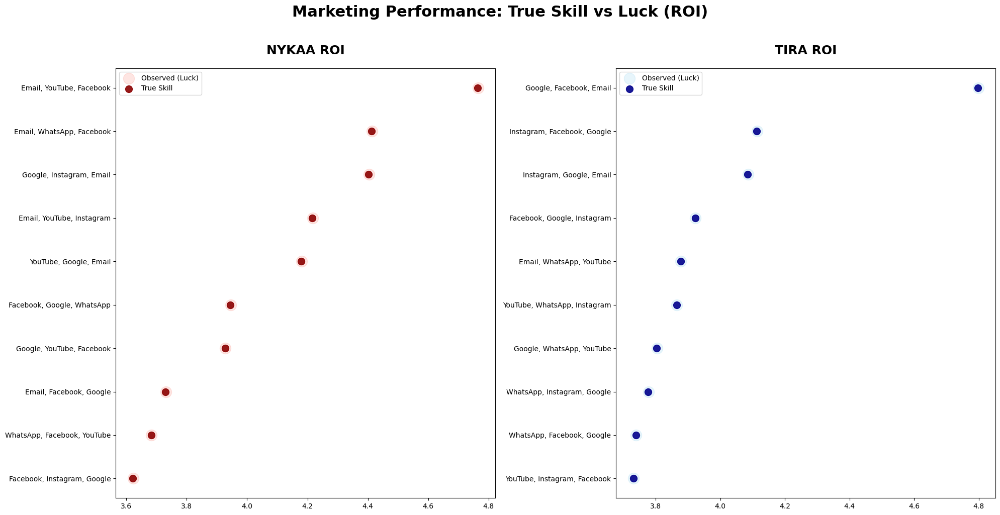
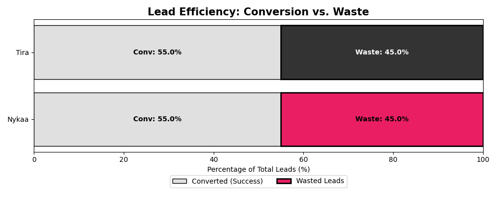

# 💄 Marketing Performance Audit & Predictive Modeling: Nykaa vs. Tira
### Advanced Hypothesis Testing, Bayesian Shrinkage (James-Stein), and Stochastic Monte Carlo Simulations

## 📌 Project Overview
This repository contains an advanced statistical marketing audit evaluating 50,000+ cross-channel campaigns to compare the customer acquisition performance architectures of beauty retail giants Nykaa and Tira[cite: 2]. Moving beyond basic descriptive summaries, this project deploys rigorous frequentist and probabilistic frameworks to solve a fundamental corporate problem: **Is one brand structurally outperforming its competitor, or are observed ROI variances merely a product of short-term statistical noise?**[cite: 2]

---

## 🛠️ Technical Stack & Frameworks
* **Data Manipulation & Processing:** Pandas, NumPy[cite: 2]
* **Statistical Computing:** SciPy (Hypothesis Testing & Probability Distributions)[cite: 2]
* **Probabilistic Modeling:** James-Stein Shrinkage Estimators (Tango Method Approach)[cite: 2]
* **Stochastic Simulations:** Monte Carlo Random Walks (10,000 Operational Iterations)[cite: 2]
* **Statistical Visualization:** Matplotlib, Seaborn[cite: 2]

---

## 🔬 Core Methodology & Deep-Dive Analytics

### 1️⃣ Hypothesis Testing (The Baseline Validation)
Before implementing complex predictive modeling, a strict frequentist validation layer was established to determine baseline statistical boundaries[cite: 2].
* **Homogeneity of Variance:** Executed Levene’s Test to check for equal variance between both brand datasets, establishing structural stability for downstream parametric testing[cite: 2].
* **Two-Sample Difference-of-Means:** Applied a standard two-sample Student's T-Test directly to campaign Return on Investment (ROI) variables following variance confirmation[cite: 2].
* **The Statistical Verdict:** The pipeline generated an exact p-value of **0.1487**[cite: 2]. Because this value sits well above the standard significance threshold ($\alpha = 0.05$), the model fails to reject the null hypothesis ($H_0$)[cite: 2]. This mathematically proves that the observed ROI gap between Nykaa and Tira is not statistically significant and remains entirely within normal distribution noise[cite: 2].

[cite: 2]

### 2️⃣ True Skill vs. Luck (Bayesian Shrinkage Framework)
To rank the top 10 multi-channel marketing combinations deployed during the April 2025 campaign cycle, the pipeline implements a James-Stein Estimator[cite: 2]. This empirical Bayes formulation actively dampens data distortion by "shrinking" highly volatile, raw observed ROI points back toward the collective brand average, filtering out short-term "lucky" outperforming outliers[cite: 2].
* **The Halo Effect Visualization:** Faint outer circles (Observed ROI) map volatile, raw experimental data, while solid inner dots isolate the calculated True Skill level post-shrinkage correction[cite: 2].
* **Strategic Utility:** This prevents media-buying teams from over-allocating capital to volatile channels that temporarily spiked due to micro-trends rather than systemic channel health[cite: 2].
* **Scope:** This evaluation isolates the top 10 channel architectures active during the April 2025 cycle[cite: 2].

[cite: 2]

### 3️⃣ Stochastic Modeling: Monte Carlo Forecasting
To model pipeline stability and long-term channel performance variations, the analytics engine executed 10,000 future scenarios simulating marketing funnel traction across CTR, ROI, and checkout conversions[cite: 2].
* **The Outcome:** The stochastic random paths converged into a tight, hyper-competitive near 50/50 win probability matrix across tracking categories[cite: 2]. 
* **Data Synthesis:** Modeled via dynamic "Simulation Branches" that track cumulative multi-channel wins over progressive timeline horizons to establish clear risk tolerance profiles[cite: 2].

[cite: 2]

---

## 💡 Strategic Recommendations & Insights

### A. Content Duration Optimization
Granular distribution analytics exposed a structural "Goldilocks Zone" governing digital video ad performance metrics[cite: 2]:
* **The Sweet Spot:** Production capital and media spend should be heavily concentrated into **10-second and 25-second** creative assets to achieve peak conversion metrics[cite: 2].
* **Friction Points:** The model isolated steep performance drop-offs at the 30-second mark due to viewer fatigue, alongside unoptimized performance floors for 5-second clips, indicating insufficient timeline real estate to establish an emotional "hook"[cite: 2].

[cite: 2]

### B. True-Skill Channel Allocation (April 2025 Matrix)
Based on regularized, post-shrinkage Bayesian performance vectors, cross-channel capital should be deployed across distinct combination frameworks[cite: 2]:
* **Nykaa Optimization:** Double down on the stabilized **Email + YouTube + Facebook** multi-channel mix[cite: 2].
* **Tira Optimization:** Prioritize capital delivery across **Google + Facebook + Email** pipelines[cite: 2].

[cite: 2]

### C. Funnel Efficiency & Lead Quality Controls
Mapping "Lead Waste" metrics (acquired audience leads that fail to convert downstream into paying customers) highlights a saturated, mature competitive landscape[cite: 2]:
* **Equilibrium Ratios:** Both competing brands display matching conversion funnels, balancing at identical efficiency levels in lead management[cite: 2]. While minor fluctuations exist, the statistically narrow gap indicates that both brands have optimized their primary acquisition funnels to a similar degree[cite: 2].
* **Tactical Action:** Because baseline conversion infrastructures are evenly matched, long-term market dominance relies on marginal gains[cite: 2]. Growth teams must perform root-cause audits on outlying "High-Waste" sub-campaigns to refine lead-capture forms and maximize inbound traffic intent quality[cite: 2].

[cite: 2]

---

## 🏁 Final Audit Conclusions
The complete evaluation demonstrates that Nykaa and Tira exist in a highly optimized state of high-equilibrium competition[cite: 2]. While raw descriptive averages may superficially point to a clear leader on any given week, applying strict frequentist T-Tests and stochastic simulations proves that neither competitor has carved out a statistically valid, permanent economic "moat"[cite: 2]. Winning market share will require iterative, data-backed optimizations to funnel mechanics and ad durations rather than brute-force capital spend[cite: 2].

---

## 📊 Dataset Reference
Analysis built utilizing the open-source **Multi-Brand Marketing Campaign Performance Dataset** hosted on Kaggle[cite: 2].  
🔗 [Access Raw Kaggle Data Repository](https://www.kaggle.com/datasets/sshriya08/multi-brand-marketing-campaign-performance-dataset)[cite: 2]
