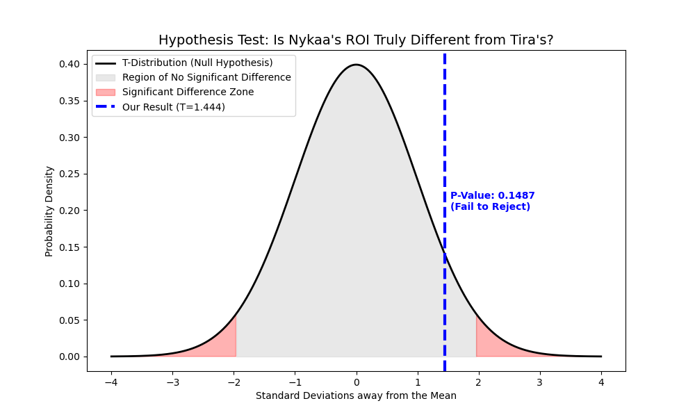
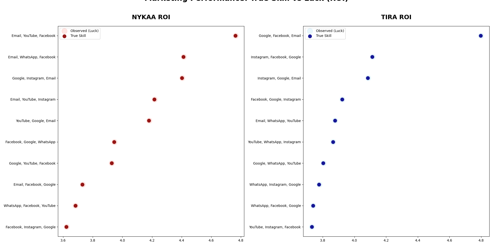
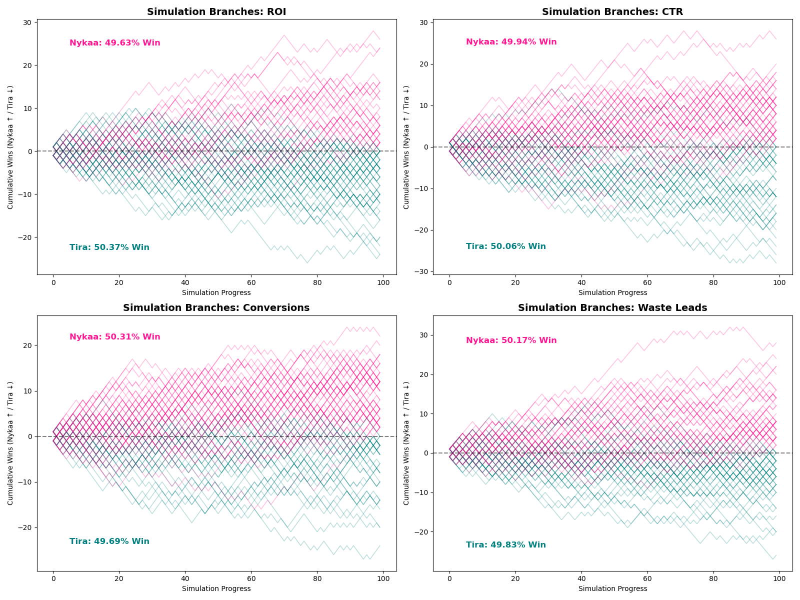
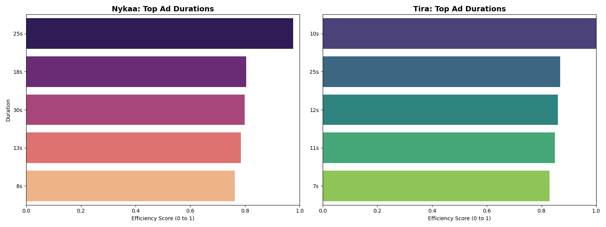

💄 Marketing Performance Audit: Nykaa vs. Tira
-------------------------------------------------------------------------------------------------------------------------------------------------------------------
Hypothesis Testing , James-Stein Estimator, & Monte Carlo Simulation

📌 Project Overview
-------------------------------------------------------------------------------------------------------------------------------------------------------------------
This repository contains a comprehensive audit of 50,000+ marketing campaigns comparing two major beauty retailers: Nykaa and Tira. The project moves beyond basic descriptive statistics to answer a fundamental business question: Is one brand structurally outperforming the other, or is the observed difference merely statistical noise?

🛠️ Technical Stack
-------------------------------------------------------------------------------------------------------------------------------------------------------------------
Data Manipulation: Pandas, NumPy

Statistical Analysis: SciPy (Hypothesis Testing)

Bayesian Modeling: James-Stein Estimators (Tango Method)

Simulation: Monte Carlo Random Walks (10,000 iterations)

Visualization: Matplotlib, Seaborn

🔬 Core Methodology & Visualizations
-------------------------------------------------------------------------------------------------------------------------------------------------------------------
1️⃣ Hypothesis Testing (The Baseline)
-------------------------------------------------------------------------------------------------------------------------------------------------------------------
Before diving into complex models, I established a statistical baseline.

Levene’s Test: Used to check for equal variance between the two brands.

Student’s T-Test: Since equal variance was confirmed, a standard T-test was applied to ROI.

The Verdict: A p-value of 0.1487 was found, meaning we fail to reject the null hypothesis. The ROI difference is not statistically significant.

2️⃣ True Skill vs. Luck (Bayesian Shrinkage)
-------------------------------------------------------------------------------------------------------------------------------------------------------------------
To rank the top 10 channel combinations, I used the James-Stein Estimator. This "shrinks" raw observed ROI toward the brand average to remove the impact of "lucky" high-performing outliers.

The Halo Effect: In the visualizations, the faint outer circles (Observed ROI) represent raw data, while the solid inner dots represent the True Skill level.

3️⃣ Monte Carlo Forecasting
-------------------------------------------------------------------------------------------------------------------------------------------------------------------
I simulated 10,000 future scenarios to determine the probability of one brand dominating the other in CTR, ROI, and Conversions.

Result: The results show a nearly 50/50 win probability, visually represented by "Simulation Branches" that track cumulative wins over time.

💡 Strategic Recommendations
-------------------------------------------------------------------------------------------------------------------------------------------------------------------
A. Content Duration Optimization
-------------------------------------------------------------
The data shows a clear "Goldilocks Zone" for ad performance.

Recommendation: Focus production on 10 and 25 seconds creative assets.

Insight: Both brands saw a performance drop-off at 30 seconds (viewer fatigue) and lower scores for 5 second clips (insufficient "hook" time).

B. Channel Allocation (The True Skill Winners)
--------------------------------------------------------------
Nykaa: Double down on the Email, YouTube, Facebook mix.

Tira: Prioritize Google, Facebook, Email.

C. Efficiency & Lead Quality
--------------------------------------------------------------------------------
The analysis of "Lead Waste" (leads that fail to convert into customers) shows a highly competitive environment.

Finding: Both Nykaa and Tira exhibit nearly identical efficiency levels in lead management. While minor fluctuations exist, the gap is statistically narrow, indicating that both brands have optimized their conversion funnels to a similar degree.

Action: Since the brands are so close, the competitive advantage will come from incremental improvements. Both should perform deep-dive audits on specific "High-Waste" campaign outliers to refine lead-capture forms and improve the quality of inbound traffic.

🏁 Conclusion
------------------------------------------------------------------------
The audit reveals that Nykaa and Tira are in a state of high-equilibrium competition. While raw numbers might suggest a leader, the Student's T-test and Monte Carlo simulations prove that neither brand has a statistically significant "moat" yet.
